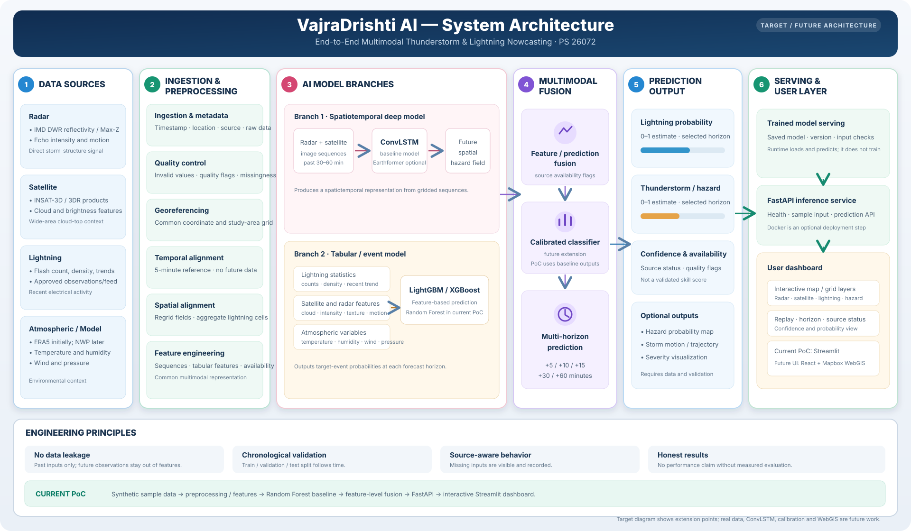

# VajraDrishti AI — Thunderstorm & Lightning Nowcasting PoC
# VajraDrishti AI: Multimodal Thunderstorm & Lightning Nowcasting System
**Team ZeninClan · Smart India Hackathon 2026 · Problem Statement 26072**

VajraDrishti AI is a proof of concept that combines radar-like, satellite-like, lightning-like, and atmospheric observations to estimate lightning and thunderstorm probabilities at **+5, +10, +15, +30, and +60 minutes**.

> **PoC scope:** The runnable app uses generated synthetic data and synthetic training labels. It demonstrates the end-to-end workflow; it is not connected to live weather feeds and has not been validated as an operational forecast or warning system. “Confidence” means input-source completeness, not model accuracy.

## System architecture



The diagram presents the **target/future architecture** and its extension points. The green strip at the bottom identifies what the repository runs today. Real IMD/MOSDAC/INSAT/lightning/NWP data, geospatial alignment, ConvLSTM, probability calibration, and WebGIS are future work—not requirements for this PoC.

## What the current PoC includes

- Reproducible synthetic replay events with radar-like, satellite-like, lightning-like, and atmospheric data.
- Basic finite-value handling, feature extraction, feature-level multimodal fusion, and source-availability flags.
- A scikit-learn Random Forest trained on synthetic proxy labels.
- Lightning and thunderstorm probability outputs for all five forecast horizons.
- A FastAPI inference service and an interactive Streamlit dashboard.
- Missing-source simulation, replay controls, multiple grid layers, a storm-core trail, and a probability timeline.
- An animated synthetic weather scene with day/night selection, changing cloud/rain/thunder conditions, and optional generated rain ambience and thunder audio.

The synthetic training labels use a simplified storm-intensity proxy. No real-world skill score or forecast accuracy is claimed.

## Run locally

### Requirements

- Python 3.10 or newer
- Git
- Internet access for the initial Python dependency installation

Clone the repository, then open a terminal in the project folder:

```bash
git clone https://github.com/Nishat30/VajraDrishti-AI-.git
cd VajraDrishti-AI-
```

### Windows PowerShell setup

```powershell
python -m venv .venv
.\.venv\Scripts\python.exe -m pip install --upgrade pip
.\.venv\Scripts\python.exe -m pip install -r requirements.txt
.\.venv\Scripts\python.exe scripts\generate_sample_data.py
```

The generator writes a labelled synthetic replay file to `data/synthetic/demo_event.json`. The dashboard can also generate its replay directly, so generating this file is optional.

### macOS / Linux setup

```bash
python3 -m venv .venv
source .venv/bin/activate
python -m pip install --upgrade pip
python -m pip install -r requirements.txt
python scripts/generate_sample_data.py
```

## Start the dashboard and API

Run these in **separate terminals** from the repository folder. The API is optional when you only want to explore the dashboard.

### Terminal 1 — Streamlit dashboard

Windows PowerShell:

```powershell
.\.venv\Scripts\python.exe -m streamlit run dashboard/app.py
```

macOS / Linux, after activating `.venv`:

```bash
python -m streamlit run dashboard/app.py
```

Open the local URL printed in the terminal, usually **http://localhost:8501**.

### Terminal 2 — FastAPI service

Windows PowerShell:

```powershell
.\.venv\Scripts\python.exe -m uvicorn api.main:app --reload
```

macOS / Linux, after activating `.venv`:

```bash
python -m uvicorn api.main:app --reload
```

The API runs at **http://localhost:8000**. Open **http://localhost:8000/docs** to try the endpoints interactively.

## Using the dashboard

At the top of the dashboard, the **synthetic weather environment** demonstrates the PoC's nowcasting workflow and how its conditions can be visualized. Use **Day** and **Night** to change its lighting, and **Sound on/off** to opt in to locally generated rain ambience and thunder audio. The rain sound grows louder during rain; thunder follows simulated lightning. Weather conditions and lightning effects evolve in the scene automatically; the scene does not read live weather data and does not drive the ML predictions. In a future production system, this scene can visualize real-time nowcast conditions from live observation data. Preferences are saved in browser storage when the embedded browser permits it. Audio begins only after you enable it with a click.

1. Choose **Synthetic replay A, B, or C**. These are generated variations, not real or historical storms.
2. Optionally choose a source under **Missing sources** to simulate unavailable data.
3. Select **Fused activity**, **Radar reflectivity**, **Cloud index**, or **Lightning density** for the simplified synthetic grid.
4. Use **◀ / ▶** or the **Storm replay scene** slider to move through the 13 scenes.
5. Select a lead time: **+05, +10, +15, +30, or +60 MIN**.
6. Read the lightning and thunderstorm probabilities, prototype risk band, source completeness, source-health panel, and probability timeline.
7. Turn **Show storm-core trail** on or off to display the replay-derived core path.

The grid is not a geographic map. Scene stepping is manual replay, not an automatic five-minute live update. Risk bands are for interface demonstration only and are not official alert thresholds. The animated weather environment is a separate visual layer and does not affect the replay's sample data or predictions.

## API endpoints

| Method | Endpoint | Purpose |
|---|---|---|
| `GET` | `/health` | Service status and model/data-mode label |
| `GET` | `/sample-data` | Return one synthetic multimodal input |
| `POST` | `/predict` | Return five-horizon probabilities, features, confidence, and data availability |
| `GET` | `/prediction/{event_id}` | Generate a synthetic demo prediction for an event ID |

For a quick API demo, open `/docs`, call **GET `/sample-data`**, then copy its JSON response into **POST `/predict`**.

The prediction response includes `predictions.lightning_probability` and `predictions.thunderstorm_probability` objects with `5_min`, `10_min`, `15_min`, `30_min`, and `60_min` values, as well as `confidence`, `data_availability`, extracted `features`, and a synthetic/demo label. Missing modality objects are accepted and reported as unavailable.

## Project layout

```text
api/                  FastAPI routes
configs/              PoC configuration
dashboard/            Streamlit user interface
data/synthetic/       Generated demo replay file
docs/                 Architecture diagram and UI guide
scripts/              Sample-data generation script
vajradrishti/         Synthetic data, features, model, and prediction pipeline
requirements.txt      Python dependencies
```

The complete dashboard walkthrough is available in [VajraDrishti UI Guide (English)](docs/VajraDrishti_UI_Guide.docx).

## Limitations and future extensions

The current app does not ingest real weather data, perform production georeferencing/regridding, compare its replay predictions against observed future events, or report validated forecast metrics. It is designed as a small, reproducible PoC. Real data adapters, chronological evaluation, calibration, ConvLSTM, and a React/Mapbox WebGIS can be considered later without changing the basic concept.
